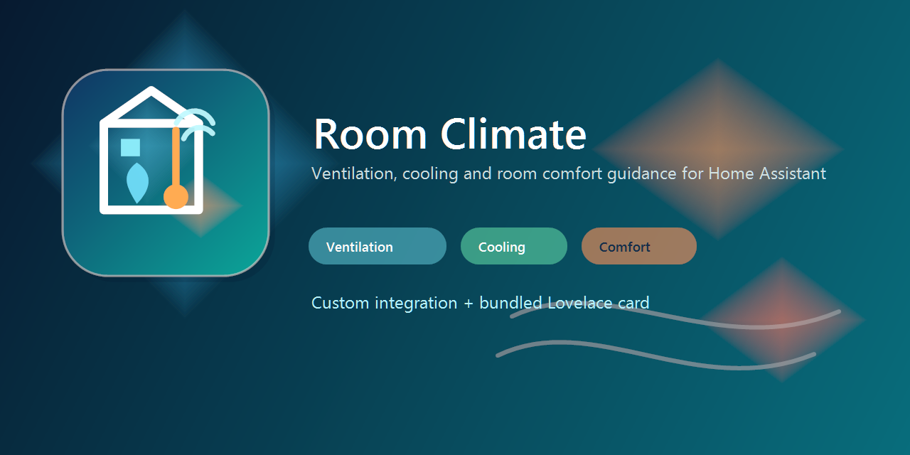

# Room Climate



Custom Home Assistant integration with bundled Lovelace card.

Features:

- room climate scoring per room
- separate advice for dehumidifying and cooling
- hourly ventilation window forecast from `weather.*`
- house-wide daily briefing with weather-based day type and prioritised actions
- optional `sun.sun` and window orientation handling
- binary sensors for:
  - ventilate now
  - close window
  - close cover / roller shade
- optional push notifications via any `notify.*` service
- bundled `custom:room-climate-card` auto-loaded by the integration

## HACS

Add this repository as a custom integration repository in HACS and install it as an integration.

After restart:

1. Add the integration in Home Assistant.
2. Configure global entities and rooms via the integration options.
3. Use the Lovelace card type:

```yaml
type: custom:room-climate-card
```

You do not need to add a separate Lovelace resource manually. The integration registers the card automatically.

## Created Entities

For the whole installation, the integration creates:

- `sensor.room_climate_tageslage` (actual entity ID depends on your integration name)

The day briefing classifies the next 24 hours as a cool, mild, summer, or hot day. Its attributes contain the forecast range, average room score, most affected room, and a ready-to-use action summary for dashboards and automations. The bundled card displays this briefing automatically.

For each configured room, the integration creates:

- `sensor.<room>_score`
- `sensor.<room>_recommendation`
- `binary_sensor.<room>_ventilate_now`
- `binary_sensor.<room>_close_window`
- `binary_sensor.<room>_close_cover`

## Notes

- Push notifications are sent only when the recommendation changes from inactive to active.
- A configurable cooldown prevents repeated notifications.
- The bundled Lovelace card is still useful for rich per-room display, while the integration handles backend logic and automation-friendly entities.
